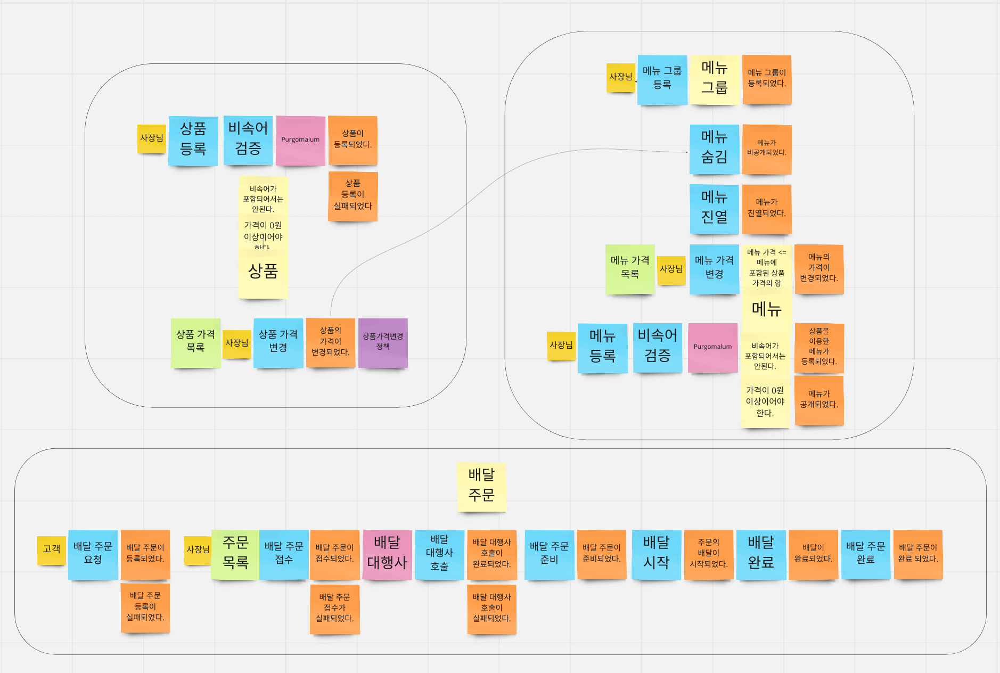
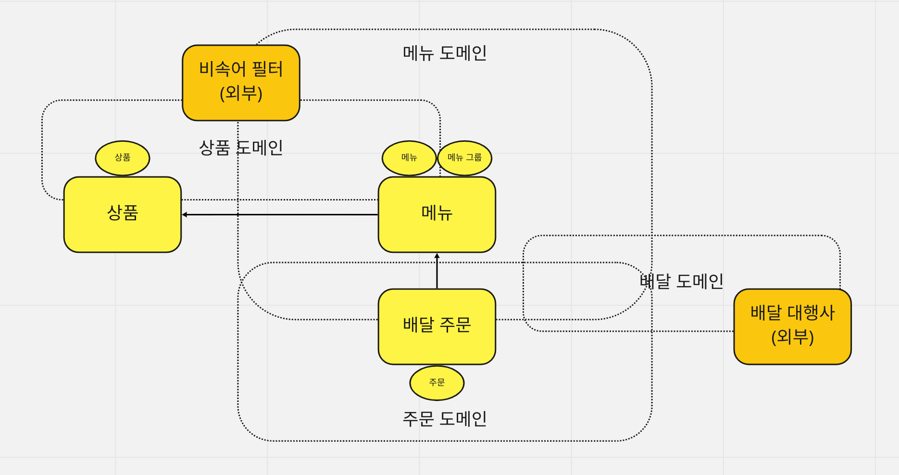

# ☕️ Daily Coffee

Daily Coffee는 Layered Architecture 기반의 Kotlin, Spring, JPA, Gradle, MySQL, Docker 및 도메인 주도 설계(Domain
Driven Design)를 활용한 최신 웹 서비스 개발을 보여줍니다.

## 요구 사항

Daily Coffee 커피 전문점 주문 시스템을 구현한다.

### 상품

- 상품 등록
  - [ ] 상품을 등록할 수 있다.
  - [ ] 상품의 가격이 올바르지 않으면 등록할 수 없다.
    - [ ] 상품의 가격은 0원 이상이어야 한다.
  - [ ] 상품의 이름이 올바르지 않으면 등록할 수 없다.
    - [ ] 상품의 이름에는 비속어가 포함될 수 없다.
- 상품 가격 변경
  - [ ] 상품의 가격을 변경할 수 있다.
  - [ ] 상품의 가격이 올바르지 않으면 변경할 수 없다.
    - [ ] 상품의 가격은 0원 이상이어야 한다.
  - [ ] 상품의 가격이 변경될 때 메뉴의 가격이 메뉴에 속한 상품 금액의 합보다 크면 메뉴가 숨겨진다.
- 상품 조회
  - [ ] 상품의 목록을 조회할 수 있다.

### 메뉴 그룹

- 메뉴 그룹 등록
  - [ ] 메뉴 그룹을 등록할 수 있다.
  - [ ] 메뉴 그룹의 이름이 올바르지 않으면 등록할 수 없다.
    - [ ] 메뉴 그룹의 이름은 비워 둘 수 없다.
- 메뉴 그룹 조회
  - [ ] 메뉴 그룹의 목록을 조회할 수 있다.

### 메뉴

- 메뉴 등록
  - [ ] 1 개 이상의 등록된 상품으로 메뉴를 등록할 수 있다.
  - [ ] 상품이 없으면 등록할 수 없다.
  - [ ] 메뉴에 속한 상품의 수량은 0 이상이어야 한다.
  - [ ] 메뉴의 가격이 올바르지 않으면 등록할 수 없다.
    - [ ] 메뉴의 가격은 0원 이상이어야 한다.
  - [ ] 메뉴에 속한 상품 금액의 합은 메뉴의 가격보다 크거나 같아야 한다.
  - [ ] 메뉴는 특정 메뉴 그룹에 속해야 한다.
  - [ ] 메뉴의 이름이 올바르지 않으면 등록할 수 없다.
    - [ ] 메뉴의 이름에는 비속어가 포함될 수 없다.
- 메뉴 가격 변경
  - [ ] 메뉴의 가격을 변경할 수 있다.
  - [ ] 메뉴의 가격이 올바르지 않으면 변경할 수 없다.
    - [ ] 메뉴의 가격은 0원 이상이어야 한다.
  - [ ] 메뉴에 속한 상품 금액의 합은 메뉴의 가격보다 크거나 같아야 한다.
- 메뉴 공개
  - [ ] 메뉴를 공개할 수 있다.
  - [ ] 메뉴의 가격이 메뉴에 속한 상품 금액의 합보다 높을 경우 메뉴를 공개할 수 없다.
- 메뉴 숨김
  - [ ] 메뉴를 숨길 수 있다.
- 메뉴 조회
  - [ ] 메뉴의 목록을 조회할 수 있다.

### 배달 주문

- 주문 등록
  - [ ] 1개 이상의 등록된 메뉴로 배달 주문을 등록할 수 있다.
  - [ ] 메뉴가 없으면 등록할 수 없다.
  - [ ] 숨겨진 메뉴는 주문할 수 없다.
  - [ ] 주문한 메뉴의 가격은 실제 메뉴 가격과 일치해야 한다.
  - [ ] 주문 항목의 수량은 0 이상이어야 한다.
  - [ ] 배달 주소가 올바르지 않으면 배달 주문을 등록할 수 없다.
- 주문 접수
  - [ ] 주문을 접수한다.
  - [ ] 접수 대기 중인 주문만 접수할 수 있다.
  - [ ] 배달 대행사를 호출한다.
- 주문 준비
  - [ ] 주문을 배송 가능한 상태로 준비한다.
  - [ ] 접수된 주문만 준비할 수 있다.
- 주문 배달
  - [ ] 주문을 배달한다.
  - [ ] 준비된 주문만 배달할 수 있다.
- 주문 배달 완료
  - [ ] 주문을 배달 완료한다.
  - [ ] 배달 중인 주문만 배달 완료할 수 있다.
- 주문 완료
  - [ ] 주문을 완료한다.
  - [ ] 주문 배달 완료된 주문만 주문 완료할 수 있다.
- 주문 조회
  - [ ] 주문 목록을 조회할 수 있다.

## 이벤트 스토밍

## 용어 사전

### 공통

| 한글명 | 영문명 | 설명 |
| --- | --- | --- |  
| 비속어 | profanity | 비속어를 의미한다. 욕설 또는 불편한 단어를 포함할 수 있다. |

### 상품

| 한글명 | 영문명 | 설명 |
| --- | --- | --- |
| 상품 | product | 메뉴를 관리하는 기준이 되는 데이터 |
| 이름 | displayed name | 음식을 상상하게 만드는 중요한 요소 |
| 가격 | price | 상품의 가격 |

### 메뉴

| 한글명 | 영문명 | 설명 |
| --- | --- | --- |
| 메뉴 | menu | 메뉴 그룹에 속하는 실제 주문 가능 단위 |
| 이름 | displayed name | 음식을 상상하게 만드는 중요한 요소 |
| 가격 | price | 메뉴의 가격 |
| 금액 | amount | 가격 * 수량 |
| 메뉴 그룹 | menu group | 각각의 메뉴를 성격에 따라 분류하여 묶어둔 그룹 |
| 메뉴 상품 | menu product | 메뉴에 속하는 수량이 있는 상품 |
| 메뉴 옵션 | menu option | 메뉴에 추가로 등록할 수 있는 가격이 추가되는 옵션 |
| 숨겨진 메뉴 | not displayed menu | 주문할 수 없는 숨겨진 메뉴 |

### 배달 주문

| 한글명 | 영문명 | 설명 |
| --- | --- | --- |
| 주문 | order | 집이나 직장 등 고객이 선택한 주소로 음식을 배달한다. |
| 주문 상태 | order status | 주문이 생성되면 매장에서 주문을 접수하고 고객이 음식을 받기까지의 단계를 표시한다. |
| 주문 항목 | order line item | 주문에 속하는 수량이 있는 메뉴 |
| 접수 대기 | waiting | 주문이 생성되어 매장으로 전달된 단계 |
| 접수 | accepted | 주문을 받고 음식을 조리하는 단계 |
| 서빙 | served | 조리가 완료되어 음식이 나갈 수 있는 단계 |
| 배달 | delivering | 배달원이 매장을 방문하여 배달 음식의 픽업을 완료하고 배달을 시작하는 단계 |
| 배달 대행사 | delivery agency | 준비한 음식을 고객에게 직접 배달하는 서비스 |
| 배달 완료 | delivered | 배달원이 주문한 음식을 고객에게 배달 완료한 단계 |
| 완료 | completed | 배달 및 결제 완료 단계 |
